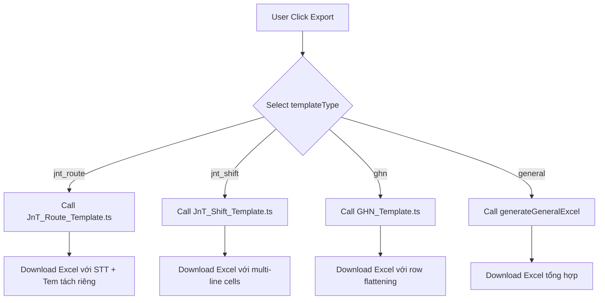

# 📊 Hướng dẫn Xuất Excel - Export Templates

## 🔍 Vấn đề đã Fix

**Bug**: File Excel xuất ra không đúng với function xử lý
**Nguyên nhân**: Có 2 function trùng tên `generateJnTRouteExcel` - function cũ chưa xóa gây nhầm lẫn
**Giải pháp**: Đã xóa function cũ, chỉ giữ lại strategy mới trong `strategies/JnT_Route_Template.ts`

---

## 📋 Danh sách Mẫu Export

Hiện tại hệ thống có **4 templates** cho các khách hàng:

### 1️⃣ Mẫu J&T Theo Tuyến (Route-based) ✅ ĐÃ HOÀN THIỆN

**templateType**: `jnt_route`

**File xử lý**: `app/api/reconciliation/export/strategies/JnT_Route_Template.ts`

**Cấu trúc Excel**:
| Cột | Header | Nguồn dữ liệu | Logic |
|-----|--------|---------------|-------|
| A | STT | Auto-increment | 1, 2, 3... |
| B | Ngày | `order.date` | Format: dd/MM/yyyy |
| C | Biển số xe | `chiTietLoTrinh[0].bienKiemSoat` | Phần tử đầu tiên |
| D | Điểm đi - Điểm đến | `order.route_name` | Trực tiếp từ DB |
| E | Tem chiều đi | `chiTietLoTrinh[0].maTuyen` | Phần tử đầu tiên |
| F | Tem chiều về | `chiTietLoTrinh[length-1].maTuyen` | Phần tử cuối cùng |
| G | Thể tích | `chiTietLoTrinh[].taiTrongTinhPhi` | Nối bằng dấu phẩy |

**Styling**:
- Header: Background `#C0C0C0` (silver gray), Font bold đen
- Data: Border thin, Center alignment, wrapText: true

**API Call**:
```
GET /api/reconciliation/export?templateType=jnt_route&fromDate=2024-01-01&khachHang=J%26T
```

**Output**: `Doisoat_JnT_TheoTuyen_YYYYMMDD_HHMMSS.xlsx`

**Đặc điểm quan trọng**:
- ✅ Có cột STT (7 cột total)
- ✅ Single-line cells: Mỗi tem đi/về riêng biệt (first/last logic)
- ✅ Route name từ DB: Lấy order.route_name thay vì JSON
- ✅ Standard row height 20px

---

### 2️⃣ Mẫu J&T Theo Ca (Shift-based) ✅ ĐÃ HOÀN THIỆN

**templateType**: `jnt_shift`

**File xử lý**: `app/api/reconciliation/export/strategies/JnT_Shift_Template.ts`

**Cấu trúc Excel**:
| Cột | Header | Nguồn dữ liệu | Logic |
|-----|--------|---------------|-------|
| A | Ngày | `order.date` | Format: dd/MM/yyyy |
| B | Biển số xe | `chiTietLoTrinh[].bienKiemSoat` | Unique values, nối bằng dấu phẩy |
| C | Mã tem | `chiTietLoTrinh[].maTuyen` | Gộp TẤT CẢ bằng xuống dòng (`\n`) |
| D | Điểm đi - Điểm đến | `chiTietLoTrinh[].loTrinhChiTiet` | Gộp TẤT CẢ bằng xuống dòng (`\n`) |
| E | Thể tích | `chiTietLoTrinh[].taiTrongTinhPhi` | Gộp TẤT CẢ bằng xuống dòng (`\n`) |
| F | Loại ca | `chiTietLoTrinh[].loaiCa` | Gộp TẤT CẢ bằng xuống dòng (`\n`) |

**Styling**:
- Header: Background `#D3D3D3` (light gray), Font bold size 12
- Data: Border thin, Center alignment, **wrapText: true** (CRITICAL for multi-line cells)
- Row height: Auto-calculated based on number of lines (maxLines × 15px)

**API Call**:
```
GET /api/reconciliation/export?templateType=jnt_shift&fromDate=2024-01-01&khachHang=J%26T
```

**Output**: `Doisoat_JnT_TheoCa_YYYYMMDD_HHMMSS.xlsx`

**Đặc điểm quan trọng**:
- ✅ Multi-line cells: Mỗi mã tem/lộ trình/thể tích/loại ca nằm trên 1 dòng riêng trong cùng 1 ô
- ✅ wrapText enabled: Cho phép Excel hiển thị nội dung xuống dòng
- ✅ Auto row height: Chiều cao dòng tự động tăng theo số lượng chi tiết
- ⚠️ KHÔNG có cột STT trong mẫu này

---

### 3️⃣ Mẫu GHN (Row Flattening) ✅ ĐÃ HOÀN THIỆN

**templateType**: `ghn`

**File xử lý**: `app/api/reconciliation/export/strategies/GHN_Template.ts`

**Cấu trúc Excel**:
| Cột | Header | Nguồn dữ liệu | Logic |
|-----|--------|---------------|-------|
| A | STT | Auto-increment | 1, 2, 3... (continuous) |
| B | Ngày | `order.date` | Format: dd/MM/yyyy, repeated for all detail rows |
| C | Biển số xe | `item.bienKiemSoat` | From chiTietLoTrinh item |
| D | Trọng tải yêu cầu | `item.taiTrongTinhPhi` | From chiTietLoTrinh item |
| E | Hình thức tính giá | `item.hinhThucTinhGia` | From chiTietLoTrinh item |
| F | Lộ trình | `item.loTrinhChiTiet` | From chiTietLoTrinh item |
| G | Số KM | `item.quangDuong` | From chiTietLoTrinh item |
| H | Đơn giá khung | `item.donGia` | From chiTietLoTrinh item |
| I | Vé cầu đường | - | Empty (leave blank) |
| J | Phí dừng tải | - | Empty (leave blank) |
| K | Tỷ lệ Ontime | - | Empty (leave blank) |
| L | Thành tiền (chưa VAT) | - | Empty (leave blank) |
| M | Tên tuyến | `item.loTrinh` | From chiTietLoTrinh item |
| N | Mã chuyến | `item.maTuyen` | From chiTietLoTrinh item |

**Styling**:
- Header: Background `#EEEEEE` (light gray), Font bold size 11, Center alignment
- Data: Border thin, Center/Middle alignment, Row height 20px
- Number format: `#,##0` for price columns (if numeric values exist)

**Core Logic - Row Flattening**:
```typescript
// Input: 1 order with chiTietLoTrinh = [item1, item2, item3]
// Output: 3 separate Excel rows

order.details.chiTietLoTrinh.forEach(item => {
  worksheet.addRow({
    stt: globalSTT++,           // Continuous counter across all orders
    date: order.date,            // Repeated from parent
    licensePlate: item.bienKiemSoat,
    weight: item.taiTrongTinhPhi,
    // ... other fields from item
  });
});
```

**API Call**:
```
GET /api/reconciliation/export?templateType=ghn&fromDate=2024-01-01&khachHang=GHN
```

**Output**: `Doisoat_GHN_YYYYMMDD_HHMMSS.xlsx`

**Đặc điểm quan trọng**:
- ✅ Row Flattening: 1 order có N items → tạo N rows trong Excel
- ✅ Global STT: Số thứ tự liên tục xuyên suốt tất cả orders (không reset về 1)
- ✅ Parent data repeated: Cột "Ngày" lặp lại giống nhau cho các dòng chi tiết
- ✅ Standard cells: KHÔNG dùng multi-line, mỗi item = 1 row riêng biệt
- ⚠️ Empty columns: 4 cột (I, J, K, L) để trống theo yêu cầu khách hàng

---

### 4️⃣ Mẫu Tổng Hợp (General) ✅ CÓ SẴN

**templateType**: `general`

**File xử lý**: Inline function trong `route.ts`

**Cấu trúc**: Bảng tổng hợp tất cả orders với các cột cơ bản (Mã chuyến, Ngày, Khách hàng, Tuyến, Tài xế, Trạng thái, Chi phí, Doanh thu)

---

## 🚨 Lưu ý quan trọng

### ❌ Lỗi thường gặp

**1. File Excel không có cột STT khi dùng jnt_route**
- **Nguyên nhân**: Đang gọi nhầm `templateType=jnt_shift` thay vì `jnt_route`
- **Giải pháp**: Verify đang gọi đúng `templateType=jnt_route`

**2. File Excel không có cột STT trong mẫu J&T Theo Ca**
- **Nguyên nhân**: Mẫu Theo Ca không có cột STT (design intentional)
- **Giải pháp**: Đây là thiết kế đúng, không cần sửa

**3. Mã tem/Lộ trình không hiển thị multi-line**
- **Nguyên nhân**: Excel chưa bật wrap text hoặc row height quá nhỏ
- **Giải pháp**: Double-click vào border giữa các row để auto-fit height

**4. Mẫu GHN không gộp dữ liệu vào 1 dòng**
- **Nguyên nhân**: Đây là thiết kế đúng - GHN template dùng row flattening
- **Giải pháp**: Không cần sửa, mỗi item trong chiTietLoTrinh sẽ tạo 1 row riêng

**5. STT trong mẫu GHN không reset về 1 cho mỗi order mới**
- **Nguyên nhân**: Đây là thiết kế đúng - Global STT counter
- **Giải pháp**: Không cần sửa, STT là continuous counter (1, 2, 3... across all orders)

---

## 📊 So sánh Templates

| Feature | J&T Route | J&T Shift | GHN | General |
|---------|-----------|-----------|-----|---------|
| **Số cột** | 7 | 6 | 14 | ~10 |
| **Có STT** | ✅ | ❌ | ✅ | ❌ |
| **Multi-line cells** | ❌ | ✅ | ❌ | ❌ |
| **Row flattening** | ❌ | ❌ | ✅ | ❌ |
| **Logic cốt lõi** | First/Last stamp | Multi-line aggregation | 1 item = 1 row | Standard table |
| **wrapText** | ✅ | ✅ (Critical) | ❌ | ❌ |
| **Empty columns** | ❌ | ❌ | ✅ (4 cols) | ❌ |

---

## 🎯 Testing Checklist

Khi test mẫu **J&T Theo Tuyến** (`jnt_route`):

- [x] Excel có 7 cột (STT, Ngày, Biển số xe, Điểm đi-đến, Tem đi, Tem về, Thể tích)
- [x] Cột STT tăng dần từ 1
- [x] Tem chiều đi = maTuyen đầu tiên
- [x] Tem chiều về = maTuyen cuối cùng
- [x] Điểm đi - Điểm đến = order.route_name
- [x] Header background màu xám bạc (#C0C0C0)
- [x] Tất cả cell có border thin

Khi test mẫu **J&T Theo Ca** (`jnt_shift`):

- [x] Excel có 6 cột (Ngày, Biển số xe, Mã tem, Điểm đi-đến, Thể tích, Loại ca)
- [x] KHÔNG có cột STT
- [x] Mã tem hiển thị multi-line (mỗi tem 1 dòng) trong cùng 1 ô
- [x] Điểm đi - Điểm đến hiển thị multi-line (từ chiTietLoTrinh, không phải route_name)
- [x] Thể tích hiển thị multi-line (mỗi giá trị 1 dòng)
- [x] Loại ca hiển thị multi-line
- [x] Header background màu xám nhạt (#D3D3D3)
- [x] Tất cả cell có border thin và wrapText enabled
- [x] Row height tự động tăng khi có nhiều dòng nội dung

Khi test mẫu **GHN** (`ghn`):

- [ ] Excel có 14 cột (A-N)
- [ ] Cột STT tăng dần liên tục xuyên suốt tất cả orders
- [ ] Mỗi item trong chiTietLoTrinh tạo 1 row riêng
- [ ] Cột "Ngày" lặp lại cho tất cả detail rows của cùng 1 order
- [ ] 4 cột (I, J, K, L) để trống
- [ ] Header background màu xám nhạt (#EEEEEE)
- [ ] Tất cả cell có border thin
- [ ] Không có multi-line cells (mỗi item = 1 row)

---

## 🔄 Flow Diagram



---

## 📞 Support

Nếu gặp vấn đề:
1. Check console log: `📊 Export Request:` để xem templateType
2. Verify API endpoint params
3. Inspect Excel header row để confirm mẫu nào được dùng
4. Đọc `strategies/README.md` để hiểu strategy pattern
5. Review code trong `strategies/` folder để hiểu implementation chi tiết
