# 📊 Hướng dẫn Xuất Excel - J&T Templates

## 🔍 Vấn đề đã Fix

**Bug**: File Excel xuất ra không đúng với function xử lý
**Nguyên nhân**: Có 2 function trùng tên `generateJnTRouteExcel` - function cũ chưa xóa gây nhầm lẫn
**Giải pháp**: Đã xóa function cũ, chỉ giữ lại strategy mới trong `strategies/JnT_Route_Template.ts`

---

## 📋 Danh sách Mẫu Export cho J&T

Hiện tại hệ thống có **2 mẫu export** cho khách hàng J&T:

### 1️⃣ Mẫu Theo Tuyến (Route-based) ✅ ĐÃ HOÀN THIỆN

**templateType**: `jnt_route`

**File xử lý**: `app/api/reconciliation/export/strategies/JnT_Route_Template.ts`

**Cấu trúc Excel**:
| Cột | Header | Nguồn dữ liệu | Logic |
|-----|--------|---------------|-------|
| A | STT | Auto-increment | 1, 2, 3... |
| B | Ngày | `order.date` | Format: dd/MM/yyyy |
| C | Biển số xe | `chiTietLoTrinh[0].bienKiemSoat` | Phần tử đầu tiên |
| D | Điểm đi - Điểm đến | `order.route_name` | Trực tiếp từ DB |
| E | Tem chiều đi | `chiTietLoTrinh[0].maTuyen` | Phần tử đầu tiên |
| F | Tem chiều về | `chiTietLoTrinh[length-1].maTuyen` | Phần tử cuối cùng |
| G | Thể tích | `chiTietLoTrinh[].taiTrongTinhPhi` | Nối bằng dấu phẩy |

**Styling**:
- Header: Background `#C0C0C0` (silver), Font bold
- Data: Border thin, Center alignment, wrapText enabled

**API Call**:
```
GET /api/reconciliation/export?templateType=jnt_route&fromDate=2024-01-01&khachHang=J%26T
```

**Output**: `Doisoat_JnT_TheoTuyen_YYYYMMDD_HHMMSS.xlsx`

---

### 2️⃣ Mẫu Theo Ca (Shift-based) ⚠️ PLACEHOLDER

**templateType**: `jnt_shift`

**File xử lý**: `app/api/reconciliation/export/route.ts` (dòng 375+)

**Trạng thái**: **CHƯA IMPLEMENT** - Chỉ là placeholder với TODO comment

**Cấu trúc dự kiến** (8 cột):
- Ca làm việc
- Tài xế
- Biển số xe
- Giờ bắt đầu
- Giờ kết thúc
- Số chuyến
- Tổng chi phí
- Ghi chú

**TODO Tasks**:
- [ ] Group data by shift/driver
- [ ] Calculate shift timing metrics
- [ ] Add fuel consumption data
- [ ] Count delivery trips per shift
- [ ] Implement proper styling

**API Call**:
```
GET /api/reconciliation/export?templateType=jnt_shift&fromDate=2024-01-01&khachHang=J%26T
```

**Output hiện tại**: Excel với 2 dòng placeholder text

---

## 🚨 Lưu ý quan trọng

### ❌ Lỗi thường gặp

**1. File Excel hiển thị "TODO: Implement J&T Shift-specific logic here"**
- **Nguyên nhân**: Đang gọi `templateType=jnt_shift` thay vì `templateType=jnt_route`
- **Giải pháp**: Đổi sang `templateType=jnt_route`

**2. File Excel không có cột STT**
- **Nguyên nhân**: Đang gọi function cũ (đã xóa) hoặc cache browser
- **Giải pháp**: Hard refresh browser (Cmd+Shift+R), clear cache

**3. Tem chiều đi/về bị gộp chung**
- **Nguyên nhân**: Đang dùng mẫu multi-line cũ
- **Giải pháp**: Verify đang gọi `templateType=jnt_route` đúng

---

## 🔄 Workflow Export

```mermaid
graph LR
    A[User Click Export] --> B{Select templateType}
    B -->|jnt_route| C[Call JnT_Route_Template.ts]
    B -->|jnt_shift| D[Call generateJnTShiftExcel]
    B -->|general| E[Call generateGeneralExcel]
    C --> F[Download Excel với STT + Tem tách]
    D --> G[Download Excel placeholder]
    E --> H[Download Excel tổng hợp]
```



---

## 📝 Testing Checklist

Khi test mẫu **Theo Tuyến** (`jnt_route`):

- [ ] File Excel có 7 cột (STT, Ngày, Biển số xe, Điểm đi-đến, Tem đi, Tem về, Thể tích)
- [ ] Cột STT tăng dần từ 1
- [ ] Tem chiều đi = maTuyen đầu tiên
- [ ] Tem chiều về = maTuyen cuối cùng
- [ ] Điểm đi - Điểm đến = order.route_name
- [ ] Header background màu xám bạc (#C0C0C0)
- [ ] Tất cả cell có border thin

Khi test mẫu **Theo Ca** (`jnt_shift`):

- [ ] Excel hiển thị placeholder text (expected - chưa implement)

---

## 🛠️ Cách Implement Mẫu Theo Ca

1. Tạo file mới: `strategies/JnT_Shift_Template.ts`
2. Copy skeleton từ `JnT_Route_Template.ts`
3. Implement logic group by shift + driver
4. Update import trong `route.ts`
5. Update case `jnt_shift` để gọi strategy mới
6. Test với data thực

---

## 📞 Support

Nếu gặp vấn đề:
1. Check console log: `📊 Export Request:` để xem templateType
2. Verify API endpoint params
3. Inspect Excel header row để confirm mẫu nào được dùng
4. Đọc `strategies/README.md` để hiểu pattern
